# Iris — System Breadboard

Breadboard of Shape B (Web-First with Local Backend), designed from shaped parts.

---

## Places

| # | Place | Description |
|---|-------|-------------|
| P1 | Inbox | Main view — message list, category tabs, view mode toggle |
| P2 | Thread View | Read a conversation — messages, AI summary, trust indicators |
| P3 | Compose | Write/reply — rich editor, AI assist, attachments |
| P3.1 | Compose (Modal) | Compose as modal overlay from P1 or P2 |
| P4 | Chat Panel | AI sidebar — NL queries, briefings, email actions (available from P1, P2) |
| P5 | Search | Find email — keyword + semantic, filters, answer extraction |
| P6 | Newsletter Feed | Subscription content — inline rendering, manage subscriptions |
| P7 | Account Setup | Add account — provider selection, OAuth2 flow, IMAP config |
| P8 | Settings | Config — AI connectors, categories, shortcuts, API keys |
| P9 | Backend | Server — REST handlers, sync engine, AI pipeline, data layer |

---

## UI Affordances

| # | Place | Component | Affordance | Control | Wires Out | Returns To |
|---|-------|-----------|------------|---------|-----------|------------|
| **Inbox (P1)** | | | | | | |
| U1 | P1 | inbox | category tabs (Primary, Updates, Social, + dynamic) | click | → N1 | — |
| U2 | P1 | inbox | message list | render | — | — |
| U3 | P1 | message-row | message preview (sender, subject, snippet, time, priority badge, category) | render | — | — |
| U4 | P1 | message-row | row click | click | → P2 | — |
| U5 | P1 | inbox | view mode toggle (Traditional / Messaging) | click | → N2 | — |
| U6 | P1 | inbox | bulk action bar (archive, delete, label, snooze) | click | → N3 | — |
| U7 | P1 | inbox | compose button | click | → P3.1 | — |
| U8 | P1 | inbox | search bar (focus opens P5) | click | → P5 | — |
| U9 | P1 | inbox | chat panel toggle | click | → P4 | — |
| U10 | P1 | inbox | account switcher | click | → N4 | — |
| U11 | P1 | inbox | unread badge | render | — | — |
| U12 | P1 | inbox | sync status indicator | render | — | — |
| **Thread View (P2)** | | | | | | |
| U13 | P2 | thread-view | thread header (subject, participants) | render | — | — |
| U14 | P2 | thread-view | AI summary (collapsible) | render | — | — |
| U15 | P2 | thread-view | message list in thread | render | — | — |
| U16 | P2 | message-card | message body (sanitized HTML in sandboxed iframe) | render | — | — |
| U17 | P2 | message-card | trust indicator badge (SPF/DKIM/DMARC) | render | — | — |
| U18 | P2 | message-card | tracking pixel alert | render | — | — |
| U19 | P2 | message-card | attachment list | render | — | — |
| U20 | P2 | thread-view | quick reply bar | type + click | → N5 | — |
| U21 | P2 | thread-view | thread actions (archive, label, snooze, mute, delete) | click | → N6 | — |
| U22 | P2 | thread-view | "Reply" / "Reply All" / "Forward" buttons | click | → P3.1 | — |
| **Compose (P3 / P3.1)** | | | | | | |
| U23 | P3 | compose | To / CC / BCC fields with autocomplete | type | → N7 | — |
| U24 | P3 | compose | subject field | type | — | — |
| U25 | P3 | compose | rich text editor (bold, italic, lists, inline images, markdown toggle) | type | — | — |
| U26 | P3 | compose | attachment drop zone | drop/click | → N8 | — |
| U27 | P3 | compose | AI assist button (rewrite, tone toggle, translate, suggestions) | click | → N9 | — |
| U28 | P3 | compose | send button | click | → N10 | — |
| U29 | P3 | compose | schedule send | click | → N11 | — |
| U30 | P3 | compose | save draft | click | → N12 | — |
| U31 | P3 | compose | signature selector | click | → N13 | — |
| U32 | P3 | compose | undo send bar (appears after send, 5-30s) | click | → N14 | — |
| **Chat Panel (P4)** | | | | | | |
| U33 | P4 | chat-panel | conversation history | render | — | — |
| U34 | P4 | chat-panel | chat input | type + enter | → N15 | — |
| U35 | P4 | chat-panel | suggested actions (briefing, tasks, search) | click | → N15 | — |
| U36 | P4 | chat-panel | AI response with email citations | render | — | — |
| U37 | P4 | chat-panel | action confirmation ("Archive 47 emails?") | click | → N16 | — |
| **Search (P5)** | | | | | | |
| U38 | P5 | search | search input with operator autocomplete | type | → N17 | — |
| U39 | P5 | search | filter chips (date, sender, has:attachment, label, unread) | click | → N17 | — |
| U40 | P5 | search | semantic search toggle | click | → N18 | — |
| U41 | P5 | search | answer extraction panel (direct answer above results) | render | — | — |
| U42 | P5 | search | results list (highlighted matches) | render | — | — |
| U43 | P5 | search | result row click | click | → P2 | — |
| **Newsletter Feed (P6)** | | | | | | |
| U44 | P6 | feed | newsletter list (scrollable, inline-rendered) | render | — | — |
| U45 | P6 | feed | subscription sidebar (sources, open rates) | render | — | — |
| U46 | P6 | feed | unsubscribe button per source | click | → N19 | — |
| U47 | P6 | feed | newsletter item (rendered content, not just subject) | render | — | — |
| **Account Setup (P7)** | | | | | | |
| U48 | P7 | setup | provider selector (Gmail, Outlook, Yahoo, Fastmail, Other IMAP) | click | → N20 | — |
| U49 | P7 | setup | OAuth2 redirect button | click | → N21 | — |
| U50 | P7 | setup | IMAP/SMTP manual config fields | type | — | — |
| U51 | P7 | setup | connection test indicator | render | — | — |
| U52 | P7 | setup | initial sync progress bar | render | — | — |
| **Settings (P8)** | | | | | | |
| U53 | P8 | settings | AI connector config (Ollama URL, model picker, test connection) | type + click | → N22 | — |
| U54 | P8 | settings | category manager (rename, reorder, add, remove dynamic categories) | click | → N23 | — |
| U55 | P8 | settings | keyboard shortcut customizer | click | → N24 | — |
| U56 | P8 | settings | API key management (create, revoke, set permissions) | click | → N25 | — |
| U57 | P8 | settings | theme toggle (light/dark/system) | click | → N26 | — |

---

## Code Affordances

| # | Place | Component | Affordance | Control | Wires Out | Returns To |
|---|-------|-----------|------------|---------|-----------|------------|
| **Frontend Logic** | | | | | | |
| N1 | P1 | inbox | `loadCategory(category)` — fetch messages by category | call | → N27 | → U2, U3 |
| N2 | P1 | inbox | `toggleViewMode(mode)` — switch traditional/messaging layout | call | → S1 | → U2 |
| N3 | P1 | inbox | `bulkAction(action, messageIds)` — archive/delete/label/snooze batch | call | → N28 | → U2 |
| N4 | P1 | inbox | `switchAccount(accountId)` — change active account | call | → N27 | → U2, U11 |
| N5 | P2 | thread-view | `quickReply(threadId, body)` — send inline reply | call | → N10 | → U15 |
| N6 | P2 | thread-view | `threadAction(action, threadId)` — archive/label/snooze/mute | call | → N28 | → U21 |
| N7 | P3 | compose | `contactAutocomplete(query)` — search contacts for TO/CC/BCC | call | → N29 | → U23 |
| N8 | P3 | compose | `uploadAttachment(file)` — upload to local server | call | → N30 | → U26 |
| N9 | P3 | compose | `aiAssist(action, content)` — rewrite/tone/translate via AI | call | → N31 | → U25 |
| N10 | P3 | compose | `sendEmail(draft)` — queue for SMTP send | call | → N32 | → U32 |
| N11 | P3 | compose | `scheduleSend(draft, datetime)` — schedule for later | call | → N33 | — |
| N12 | P3 | compose | `saveDraft(draft)` — persist to local DB + IMAP drafts folder | call | → N34 | — |
| N13 | P3 | compose | `selectSignature(id)` — apply signature to compose | call | → S2 | → U25 |
| N14 | P3 | compose | `undoSend(messageId)` — cancel queued send within window | call | → N35 | → U32 |
| N15 | P4 | chat-panel | `chatQuery(message)` — send NL query to AI with inbox context | call | → N36 | → U33, U36 |
| N16 | P4 | chat-panel | `confirmAction(action)` — execute confirmed bulk/email action | call | → N28 | → U37 |
| N17 | P5 | search | `keywordSearch(query, filters)` — FTS5 search | call | → N37 | → U42 |
| N18 | P5 | search | `semanticSearch(query)` — embedding-based search | call | → N38 | → U41, U42 |
| N19 | P6 | feed | `unsubscribe(senderId)` — trigger unsubscribe flow | call | → N39 | → U46 |
| N20 | P7 | setup | `selectProvider(provider)` — show provider-specific config | call | — | → U49, U50 |
| N21 | P7 | setup | `startOAuth(provider)` — initiate OAuth2 redirect | call | → N40 | → U51 |
| N22 | P8 | settings | `configureAI(ollamaUrl, model)` — set AI connector | call | → N41 | → U53 |
| N23 | P8 | settings | `updateCategories(config)` — save category config | call | → N42 | → U54 |
| N24 | P8 | settings | `updateShortcuts(bindings)` — save shortcut config | call | → S3 | → U55 |
| N25 | P8 | settings | `manageApiKey(action, config)` — create/revoke agent tokens | call | → N43 | → U56 |
| N26 | P8 | settings | `setTheme(theme)` — toggle light/dark/system | call | → S4 | → U57 |
| **WebSocket Bridge** | | | | | | |
| N44 | P1 | ws-client | `onNewEmail(event)` — receive new email notification | observe | → N1 | → U11 |
| N45 | P1 | ws-client | `onSyncStatus(event)` — receive sync progress | observe | — | → U12 |
| N46 | P2 | ws-client | `onThreadUpdate(event)` — receive thread changes | observe | — | → U15 |
| **Backend — REST Handlers** | | | | | | |
| N27 | P9 | api | `GET /messages?category=&account=` — list messages | call | → S5 | → N1 |
| N28 | P9 | api | `PATCH /messages/batch` — bulk update (archive, label, delete, snooze) | call | → S5, → N47 | → N3, N6 |
| N29 | P9 | api | `GET /contacts?q=` — search contacts | call | → S6 | → N7 |
| N30 | P9 | api | `POST /attachments` — store attachment blob | call | → S7 | → N8 |
| N31 | P9 | ai-service | `POST /ai/assist` — AI writing assistance | call | → N48 | → N9 |
| N32 | P9 | smtp-service | `POST /send` — queue email for SMTP delivery | call | → N49 | → N10 |
| N33 | P9 | scheduler | `POST /send/schedule` — schedule email for later send | call | → S8 | → N11 |
| N34 | P9 | api | `PUT /drafts` — save draft to DB + sync to IMAP | call | → S5, → N47 | → N12 |
| N35 | P9 | smtp-service | `DELETE /send/:id` — cancel queued send | call | → N49 | → N14 |
| N36 | P9 | ai-service | `POST /ai/chat` — conversational AI with inbox RAG context | call | → N48, → S5, → S9 | → N15 |
| N37 | P9 | search-service | `GET /search?q=&filters=` — FTS5 keyword search | call | → S10 | → N17 |
| N38 | P9 | search-service | `GET /search/semantic?q=` — embedding similarity search | call | → S9, → N48 | → N18 |
| N39 | P9 | subscription-service | `POST /unsubscribe` — handle List-Unsubscribe header | call | → S5 | → N19 |
| N40 | P9 | auth-service | `GET /auth/oauth/:provider` — initiate OAuth2 flow | call | → S11 | → N21 |
| N41 | P9 | ai-service | `PUT /config/ai` — save AI connector config + test connection | call | → S12, → N48 | → N22 |
| N42 | P9 | api | `PUT /config/categories` — save category configuration | call | → S12 | → N23 |
| N43 | P9 | auth-service | `POST /api-keys` — create/revoke scoped agent tokens | call | → S13 | → N25 |
| **Backend — Sync Engine** | | | | | | |
| N47 | P9 | sync-engine | `syncToServer(changes)` — push local changes to IMAP server | call | → N50 | — |
| N49 | P9 | smtp-engine | SMTP connection manager — send queued emails, handle retries | call | → S14 | — |
| N50 | P9 | imap-engine | IMAP connection manager — per-account, OAuth2 refresh, connection pool | call | → S14 | — |
| N51 | P9 | imap-engine | `initialSync(account)` — download folder structure → headers → bodies | call | → S5, → N52 | → U52 |
| N52 | P9 | ai-pipeline | `ingestEmail(message)` — classify, extract entities, embed, score priority | call | → N48, → S5, → S9, → S10 | — |
| N53 | P9 | imap-engine | `idleListener(account)` — IMAP IDLE per account → on new mail → ingest → push | observe | → N51, → N52, → N44 | — |
| **Backend — AI Pipeline** | | | | | | |
| N48 | P9 | ollama-client | `generate(model, prompt)` — send to Ollama REST API | call | → S15 | — |
| N54 | P9 | ai-pipeline | `classifyIntent(message)` — ACTION_REQUEST / INFORMATIONAL / SALES / etc. | call | → N48 | → S5 |
| N55 | P9 | ai-pipeline | `extractEntities(message)` — people, companies, dates, amounts | call | → N48 | → S5 |
| N56 | P9 | ai-pipeline | `computeEmbedding(message)` — generate vector for semantic index | call | → N48 | → S9 |
| N57 | P9 | ai-pipeline | `scorePriority(message)` — Eisenhower matrix scoring | call | → N48 | → S5 |
| N58 | P9 | ai-pipeline | `assignCategory(message)` — dynamic category assignment | call | → N48 | → S5 |
| N59 | P9 | ai-pipeline | `summarizeThread(threadId)` — generate thread summary | call | → N48, → S5 | → N31 |
| **Backend — API Layer (Agents)** | | | | | | |
| N60 | P9 | mcp-server | MCP tool handlers — search, read, compose, send, label, archive | call | → S5, → N49, → N47 | — |
| N61 | P9 | api-gateway | Token validation + permission check per request | call | → S13 | — |
| N62 | P9 | webhook-service | `dispatchWebhook(event)` — fire configured webhooks on email events | call | → S16 | — |
| N63 | P9 | audit-service | `logAction(agent, action, scope)` — append to audit trail | call | → S17 | — |

---

## Data Stores

| # | Place | Store | Description |
|---|-------|-------|-------------|
| S1 | P1 | `viewMode` | Current view mode: traditional or messaging |
| S2 | P3 | `signatures` | User's configured email signatures |
| S3 | P8 | `shortcuts` | Keyboard shortcut bindings |
| S4 | P8 | `theme` | UI theme preference |
| S5 | P9 | `messages` table | Core email store — headers, body, flags, labels, AI metadata (intent, entities, priority, category) |
| S6 | P9 | `contacts` table | Contact profiles — name, email, relationship score, communication patterns |
| S7 | P9 | `attachments` blob store | Attachment files stored locally |
| S8 | P9 | `scheduled_sends` table | Emails queued for future send |
| S9 | P9 | `embeddings` vector store | Per-message embeddings for semantic search |
| S10 | P9 | `fts_messages` FTS5 index | Full-text search index over message bodies + subjects |
| S11 | P9 | `accounts` table | Account configs — provider, OAuth tokens, IMAP/SMTP settings |
| S12 | P9 | `config` table | App configuration — AI connectors, categories, preferences |
| S13 | P9 | `api_keys` table | Scoped agent tokens with permission levels |
| S14 | P9 | Mail servers (external) | Gmail, Outlook, Yahoo, Fastmail, any IMAP server |
| S15 | P9 | Ollama (external) | AI inference sidecar — REST API at configurable URL |
| S16 | P9 | `webhooks` table | Configured webhook URLs and event filters |
| S17 | P9 | `audit_log` table | Tamper-resistant log of all agent/API actions |

---

## Key Data Flows

### Flow 1: New Email Arrives

```
Mail Server (S14) → IMAP IDLE (N53) → initialSync/fetchNew (N51)
  → store in messages table (S5)
  → ingestEmail (N52):
      → classifyIntent (N54) → S5
      → extractEntities (N55) → S5
      → computeEmbedding (N56) → S9
      → scorePriority (N57) → S5
      → assignCategory (N58) → S5
  → WebSocket push (N44) → Inbox UI updates (U2, U3, U11)
```

### Flow 2: User Reads Thread

```
Message row click (U4) → navigate to Thread View (P2)
  → GET /threads/:id (N27) → S5 → U13, U15, U16
  → summarizeThread (N59) → N48 → Ollama (S15) → U14
  → trust indicators from message headers → U17
  → tracking pixel detection → U18
```

### Flow 3: User Sends Email

```
Compose (U25) → Send (U28) → sendEmail (N10)
  → POST /send (N32) → SMTP engine (N49) → Mail Server (S14)
  → Undo window starts (U32)
  → On success: store in sent folder (S5), sync to IMAP (N47)
```

### Flow 4: AI Chat Query

```
Chat input (U34) → chatQuery (N15)
  → POST /ai/chat (N36):
      → retrieve relevant emails from S5 (RAG context)
      → retrieve relevant embeddings from S9
      → generate(model, prompt+context) via Ollama (N48 → S15)
  → AI response with citations (U36)
  → If action proposed → confirmation (U37) → confirmAction (N16) → execute
```

### Flow 5: External Agent via MCP

```
Agent sends MCP request → Token validation (N61) → Permission check (S13)
  → MCP tool handler (N60):
      → search: query S5/S9/S10
      → read: fetch from S5
      → compose: create draft in S5
      → send: queue via N49
      → label/archive: update S5, sync via N47
  → Audit log (N63 → S17)
  → Webhook dispatch if configured (N62 → S16)
```

### Flow 6: Semantic Search

```
Search input (U38) + semantic toggle (U40)
  → semanticSearch (N18) → GET /search/semantic (N38):
      → computeEmbedding for query (N48 → S15)
      → similarity search in vector store (S9)
      → fetch matching messages from S5
  → Answer extraction (N48 → S15) → U41
  → Results list → U42
```

---

## System Wiring Diagram

```mermaid
flowchart TB
    subgraph P1["P1: Inbox"]
        U1["U1: category tabs"]
        U2["U2: message list"]
        U3["U3: message row"]
        U5["U5: view toggle"]
        U7["U7: compose btn"]
        U8["U8: search bar"]
        U9["U9: chat toggle"]
        U11["U11: unread badge"]
    end

    subgraph P2["P2: Thread View"]
        U14["U14: AI summary"]
        U15["U15: messages"]
        U16["U16: message body"]
        U17["U17: trust badge"]
        U20["U20: quick reply"]
        U22["U22: reply/fwd btns"]
    end

    subgraph P3["P3: Compose"]
        U25["U25: editor"]
        U27["U27: AI assist"]
        U28["U28: send"]
        U32["U32: undo send"]
    end

    subgraph P4["P4: Chat Panel"]
        U34["U34: chat input"]
        U36["U36: AI response"]
        U37["U37: action confirm"]
    end

    subgraph P5["P5: Search"]
        U38["U38: search input"]
        U40["U40: semantic toggle"]
        U41["U41: answer extract"]
        U42["U42: results"]
    end

    subgraph P9["P9: Backend"]
        subgraph sync["Sync Engine"]
            N50["N50: IMAP manager"]
            N53["N53: IDLE listener"]
            N49["N49: SMTP engine"]
            N51["N51: sync/fetch"]
        end

        subgraph ai["AI Pipeline"]
            N52["N52: ingest"]
            N48["N48: Ollama client"]
            N54["N54: classify"]
            N56["N56: embed"]
            N57["N57: priority"]
            N59["N59: summarize"]
        end

        subgraph api["API Layer"]
            N60["N60: MCP server"]
            N61["N61: auth gate"]
            N62["N62: webhooks"]
            N63["N63: audit log"]
        end

        subgraph data["Data Layer"]
            S5["S5: messages"]
            S9["S9: embeddings"]
            S10["S10: FTS5 index"]
            S13["S13: api_keys"]
            S17["S17: audit_log"]
        end
    end

    subgraph external["External"]
        S14["S14: Mail Servers"]
        S15["S15: Ollama"]
        agents["AI Agents"]
    end

    %% Inbox flows
    U1 -->|load category| S5
    S5 -.-> U2
    S5 -.-> U3
    S5 -.-> U11
    U3 -->|click| P2
    U7 --> P3
    U8 --> P5
    U9 --> P4

    %% Thread flows
    S5 -.-> U15
    S5 -.-> U16
    N59 --> N48
    N48 --> S15
    S15 -.-> N48
    N48 -.-> U14
    U20 --> N49
    U22 --> P3

    %% Compose flows
    U27 --> N48
    U28 --> N49
    N49 --> S14

    %% Chat flows
    U34 --> N48
    S5 -.->|RAG context| N48
    S9 -.->|semantic context| N48
    N48 -.-> U36
    U37 --> S5

    %% Search flows
    U38 --> S10
    U40 --> S9
    S9 -.-> U42
    S10 -.-> U42
    N48 -.-> U41

    %% Sync engine
    S14 --> N53
    N53 --> N51
    N51 --> S5
    N51 --> N52
    N52 --> N54
    N52 --> N56
    N52 --> N57
    N54 --> N48
    N56 --> N48
    N57 --> N48
    N54 -.-> S5
    N56 -.-> S9
    N57 -.-> S5
    N52 --> S10

    %% WebSocket push
    N53 -.->|WS push| U11

    %% Agent flows
    agents --> N61
    N61 --> N60
    N60 --> S5
    N60 --> N49
    N63 --> S17
    N62 -.-> agents

    classDef ui fill:#ffb6c1,stroke:#d87093,color:#000
    classDef nonui fill:#d3d3d3,stroke:#808080,color:#000
    classDef store fill:#e6e6fa,stroke:#9370db,color:#000
    classDef ext fill:#fffacd,stroke:#daa520,color:#000

    class U1,U2,U3,U5,U7,U8,U9,U11,U14,U15,U16,U17,U20,U22,U25,U27,U28,U32,U34,U36,U37,U38,U40,U41,U42 ui
    class N48,N49,N50,N51,N52,N53,N54,N56,N57,N59,N60,N61,N62,N63 nonui
    class S5,S9,S10,S13,S17 store
    class S14,S15,agents ext
```



---

## Fit Check: Detail B × R

Verifying the detailed parts satisfy all requirements:

| Req | Requirement | Satisfied By |
|-----|-------------|-------------|
| R0.1 | Core email ops | B2.1-B2.3 (compose, reply, forward), B4.4 (SMTP send), B3.1 (drafts, templates) |
| R0.2 | Inbox management | B2.1 (threading, labels, archive, snooze), B4.5 (bidirectional sync) |
| R0.3 | Search | B2.5 (search UI), B3.2 (FTS5), B3.3 (semantic) |
| R0.4 | Organization | B2.1 (tasks from AI extraction), B2.7 (calendar — future integration) |
| R0.5 | Multi-account | B4.1 (per-account IMAP), B1.1 (account switcher API), B2.1 (unified inbox) |
| R0.6 | Rich text | B2.3 (rich editor + markdown) |
| R0.7 | Keyboard-first | B2.7 (shortcut customizer), frontend keyboard handler |
| R1.1 | Structured metadata | B5.2 (ingest: classify, extract, score) → B3.4 (AI metadata tables) |
| R1.2 | Semantic index | B5.2 (compute embedding) → B3.3 (vector store) |
| R1.3 | Knowledge graph | Future — built incrementally from B3.4 entity extraction |
| R1.4 | Attachment search | Future — extend B5.2 to parse attachments before indexing |
| R2.1 | Docker deploy | B7.1 (Docker Compose) |
| R2.2 | All data local | B3.1-B3.4 (SQLite + vectors on disk) |
| R2.3 | Offline after sync | B3 (local data layer), frontend Service Worker (future) |
| R2.4 | Zero external deps | B1 + B3 + B5 (Ollama local) — only mail server is external |
| R3.1 | MCP server | B6.2 (MCP tool handlers — N60) |
| R3.2 | REST API | B6.1 (OpenAPI spec — N27, N28, etc.) |
| R3.3 | Agent permissions | B6.3 (scoped tokens — N61, S13) |
| R3.4 | Webhooks | B6.4 (webhook dispatcher — N62, S16) |
| R3.5 | Audit trail | B6.5 (audit logger — N63, S17) |
| R4.1 | Messaging view | B2.1 (view mode toggle — U5, N2) |
| R4.2 | Newsletter feed | B2.6 (feed view — P6) |
| R4.3 | Screener | Future — extend B5.2 with sender reputation |
| R4.4 | Smart categories | B5.2 (assignCategory — N58), B2.1 (dynamic tabs — U1) |
| R4.5 | Subscription mgmt | B2.6 (unsubscribe — U46, N39) |
| R5.1 | No telemetry | Architecture — no external calls except mail server + Ollama |
| R5.2 | Local AI | B5.1 (Ollama sidecar — local) |
| R5.3 | Tracking block | B2.2 (tracking pixel alert — U18), HTML sanitizer |
| R5.4 | Auth visualization | B2.2 (trust badge — U17) |
| R5.5 | E2E encryption | Future — extend B4 with PGP/S/MIME |
| R6.1 | IMAP+SMTP | B4.1-B4.5 (full IMAP/SMTP engine) |
| R6.2 | OAuth2 | B4.1 (OAuth2 token refresh), B2.7 (OAuth setup — N21) |
| R6.3 | JMAP | Future — add as alternative transport in B4 |
| R6.4 | Provider APIs | Future — add Gmail API / Graph API adapters |
| R7.1 | Chat panel | B2.4 (chat panel — P4) |
| R7.2 | NL compose | B2.4 (chat → compose intent — N15 → N10) |
| R7.3 | Bulk NL ops | B2.4 (action confirmation — U37 → N16) |
| R7.4 | Briefings | B2.4 (suggested actions — U35) |
| R8.1 | Zero-config | B5.4 (model router defaults), B5.2 (auto-categorize from day 1) |
| R8.2 | Learns patterns | B5.2 (categories adapt), future: behavioral model |
| R8.3 | AI connectors | B5.1 (Ollama), B2.7 (config — U53) |
| R8.4 | Tiered models | B5.4 (model router — small/medium/large) |
