# V11: AI-Scalable Chat — Shaping

## Source

> "this is what i got on my basic test how does this mean its working good?"
> — User, after "Summarize my unread emails from today" returned "I don't have enough context"
>
> "there can be more such cases, our ai chat should allow solving for this"
>
> "think of an email box which has say 1M emails... this is what AI scalable first email means"
>
> "go study more on how people are solving it. think novel approach not just email approach"

---

## Problem

The current AI chat assembles context by running a single FTS5/semantic search against the user's question, then sends all results to the LLM in one shot. This breaks in three ways:

1. **Aggregate blindness** — "How many unread emails?" requires scanning all messages; search can't answer this
2. **Filter blindness** — "Emails from Google this week" requires date + sender filtering; FTS5 only does text matching
3. **Depth blindness** — "What happened with Project X?" may need multiple search passes and full email reads; one search pass isn't enough

At 1M emails, these gaps become fatal — you can't stuff the inbox into a prompt.

## Outcome

The AI chat can answer any question a human could answer by looking at their inbox — aggregates, filtered views, cross-email synthesis, individual email content — without sending more than a few relevant emails to the LLM per turn.

---

## Requirements (R)

| ID | Requirement | Status |
|----|-------------|--------|
| R0 | Answer inbox-level aggregate questions (counts, summaries, trends) without scanning all emails | Core goal |
| R1 | Answer content-specific questions about individual emails or threads | Core goal |
| R2 | Handle structured queries (date ranges, sender filters, read/unread status) | Must-have |
| R3 | Synthesize across multiple emails (cross-email reasoning like "what happened with Project X") | Must-have |
| R4 | Retrieve the right context without sending all emails to the LLM | Must-have |
| R5 | Work incrementally — new emails get indexed without full re-processing | Must-have |
| R6 | Stay within token budget (context window limits) | Must-have |
| R7 | Response latency under 10 seconds for common queries | Nice-to-have |
| R8 | No new infrastructure beyond SQLite, Memories, Ollama/cloud LLM | Must-have |
| R9 | Degrade gracefully when optional services (Memories, Ollama) are unavailable | Must-have |

---

## CURRENT: Single-Shot RAG

How it works today (`src/api/chat.rs`):

| Part | Mechanism |
|------|-----------|
| **C1** | FTS5 text search on user message (split into quoted terms, max 5 terms, top 10 results) |
| **C2** | Memories semantic search as alternative/supplement to FTS5 (BM25+vector, top 10) |
| **C3** | Merge citations, format as `[8charID] date status \| From: X \| Subject: Y \| snippet` |
| **C4** | Single `ProviderPool.generate(prompt, system)` call with all context pre-assembled |
| **C5** | Parse `ACTION_PROPOSAL:{...}` suffix from response for action confirmations |

**Where CURRENT fails:**
- R0 ❌ — No aggregate data available; FTS5 can't count
- R2 ❌ — No date/sender/read filters; FTS5 only does text matching
- R3 ❌ — Single search pass can't cross-reference or drill into details
- R4 ❌ — Sends 10 snippets regardless of question type
- R6 ❌ — At scale, even 10 snippets from 1M emails may be irrelevant noise

---

## A: Inbox Snapshot + Enhanced RAG

| Part | Mechanism | Flag |
|------|-----------|:----:|
| **A1** | `inbox_stats` materialized view — pre-computed counts (total, unread, starred, by-category, top-senders, date-range buckets), updated on each sync batch | |
| **A2** | SQL pre-filter before FTS5/semantic — date range, sender, read/unread as WHERE clauses on `messages` table | |
| **A3** | Structured email summaries — compress emails to fixed-size summaries instead of raw snippets | ⚠️ |

**Strengths:** Fast aggregates, precise filtering. **Weakness:** Still single-shot — can't iteratively refine.

## B: Agentic Tool Use

| Part | Mechanism | Flag |
|------|-----------|:----:|
| **B1** | Tool definitions — `search_emails`, `read_email`, `inbox_stats`, `list_emails` as LLM-callable tools with JSON schemas | |
| **B2** | Iterative retrieval loop — LLM calls tools, receives results, decides whether to call more tools or respond | |
| **B3** | Structured tool responses — typed JSON the LLM can reason over, not raw text | |

**Strengths:** Handles arbitrary complexity; LLM decides strategy. **Weakness:** Multiple LLM round-trips increase latency; needs tool-use API support.

## C: Summarization Tree + Entity Graph

| Part | Mechanism | Flag |
|------|-----------|:----:|
| **C1** | RAPTOR-style hierarchical summaries — thread-level → sender-level → topic-level summary trees | ⚠️ |
| **C2** | Entity graph — sender ↔ topic ↔ thread relationships in SQLite | ⚠️ |
| **C3** | Graph-guided retrieval — traverse entity graph to find related emails before searching | ⚠️ |

**Strengths:** Deep synthesis capability. **Weakness:** All parts are flagged unknowns; heavy upfront indexing cost; complex to build and maintain.

---

## Fit Check

| Req | Requirement | Status | A | B | C |
|-----|-------------|--------|---|---|---|
| R0 | Answer inbox-level aggregate questions without scanning all emails | Core goal | ✅ | ❌ | ❌ |
| R1 | Answer content-specific questions about individual emails or threads | Core goal | ✅ | ✅ | ✅ |
| R2 | Handle structured queries (date ranges, sender filters, read/unread) | Must-have | ✅ | ❌ | ❌ |
| R3 | Synthesize across multiple emails (cross-email reasoning) | Must-have | ❌ | ✅ | ✅ |
| R4 | Retrieve the right context without sending all emails to LLM | Must-have | ❌ | ✅ | ✅ |
| R5 | Work incrementally — new emails indexed without full re-processing | Must-have | ✅ | ✅ | ❌ |
| R6 | Stay within token budget (context window limits) | Must-have | ❌ | ✅ | ✅ |
| R7 | Response latency under 10 seconds for common queries | Nice-to-have | ✅ | ❌ | ❌ |
| R8 | No new infrastructure beyond SQLite, Memories, Ollama/cloud LLM | Must-have | ✅ | ✅ | ✅ |
| R9 | Degrade gracefully when optional services unavailable | Must-have | ✅ | ✅ | ❌ |

**Notes:**
- A fails R3: single-shot can't cross-reference; A3 is flagged unknown
- A fails R4, R6: still sends fixed context regardless of question type
- B fails R0: no pre-computed aggregates — LLM would need to call list_emails and count manually
- B fails R2: tools don't have structured filter parameters yet
- B fails R7: multiple LLM round-trips add latency (but acceptable for complex queries)
- C fails R0, R2: graph doesn't provide aggregate counts or filtered views
- C fails R5: hierarchical summaries need re-computation when new emails arrive
- C fails R7: graph traversal + summary lookup adds latency
- C fails R9: all parts are flagged unknowns, heavy dependencies on indexing pipeline

**Conclusion:** No single shape passes all requirements. B is the strongest foundation (handles R3, R4, R6 — the hardest problems), but needs A1 + A2 to cover R0, R2. C is deferred — its mechanisms are all flagged unknowns.

---

## Selected: Shape D — Agentic Retrieval with Materialized Inbox

**Composition:** D = B (Agentic Tool Use) + A1 (Inbox Snapshot) + A2 (SQL Pre-filter)

| Part | Mechanism | Flag |
|------|-----------|:----:|
| **D1** | **Inbox snapshot** | |
| D1.1 | `inbox_stats` table: account_id, total, unread, starred, by_category (JSON), top_senders (JSON), today_count, week_count, month_count, last_updated | |
| D1.2 | Compute trigger: after each sync batch completes, run aggregate queries and upsert stats row | |
| D1.3 | `GET /api/inbox/stats` endpoint for direct UI access | |
| **D2** | **Tool definitions** | |
| D2.1 | `Tool` struct: name, description, input_schema (JSON Schema), handler function | |
| D2.2 | `inbox_stats` tool: returns pre-computed aggregates from D1 (no params) | |
| D2.3 | `search_emails` tool: FTS5 + Memories hybrid search with optional filters (date_from, date_to, sender, is_read, category, limit) — SQL pre-filter applied before FTS5 | |
| D2.4 | `read_email` tool: fetch full email content by message_id (body_text, headers, attachments list) | |
| D2.5 | `list_emails` tool: SQL query with filters (date_from, date_to, sender, is_read, category, folder, sort, limit) — returns summary list without body content | |
| **D3** | **Agentic chat loop** | |
| D3.1 | `generate_with_tools` method on ProviderPool: accepts messages + tools, returns `LlmResponse::Text` or `LlmResponse::ToolCall` | |
| D3.2 | Anthropic implementation: native tool use via `tools` API parameter | |
| D3.3 | OpenAI implementation: native function calling via `tools` API parameter | |
| D3.4 | Ollama fallback: embed tool descriptions in system prompt, parse `TOOL_CALL:{...}` from response text | |
| D3.5 | Chat handler loop: send messages+tools → if ToolCall, execute tool, append result, re-call → if Text, done. Max 5 iterations. | |
| **D4** | **Structured tool responses** | |
| D4.1 | Each tool returns typed JSON (not prose), serialized via serde | |
| D4.2 | Tool results appended to message history as `role: "tool"` with tool_use_id linking | |
| D4.3 | Token budget tracking: sum tool result tokens, truncate or summarize if approaching limit | |

---

## Fit Check: R × D

| Req | Requirement | Status | D |
|-----|-------------|--------|---|
| R0 | Answer inbox-level aggregate questions without scanning all emails | Core goal | ✅ |
| R1 | Answer content-specific questions about individual emails or threads | Core goal | ✅ |
| R2 | Handle structured queries (date ranges, sender filters, read/unread) | Must-have | ✅ |
| R3 | Synthesize across multiple emails (cross-email reasoning) | Must-have | ✅ |
| R4 | Retrieve the right context without sending all emails to LLM | Must-have | ✅ |
| R5 | Work incrementally — new emails indexed without full re-processing | Must-have | ✅ |
| R6 | Stay within token budget (context window limits) | Must-have | ✅ |
| R7 | Response latency under 10 seconds for common queries | Nice-to-have | ✅ |
| R8 | No new infrastructure beyond SQLite, Memories, Ollama/cloud LLM | Must-have | ✅ |
| R9 | Degrade gracefully when optional services unavailable | Must-have | ✅ |

**How D satisfies each:**
- **R0**: D1 inbox_stats provides instant aggregates via D2.2 tool
- **R1**: D2.4 read_email tool fetches full content; LLM decides when to use it
- **R2**: D2.3 and D2.5 accept filter parameters; D1.1 pre-computes date buckets
- **R3**: D3.5 agentic loop lets LLM call search → read → search again iteratively
- **R4**: D3.5 LLM decides what to fetch — only calls tools needed for the question
- **R5**: D1.2 updates stats incrementally on sync; FTS5/Memories already incremental
- **R6**: D4.3 tracks token budget; D4.1 structured responses are compact
- **R7**: D1 inbox_stats is sub-millisecond; simple queries hit D2.2 or D2.5 (1 LLM turn)
- **R8**: All SQLite + existing Memories + existing ProviderPool
- **R9**: D2.3 falls back to FTS5 without Memories; D3.4 Ollama fallback for tool use

---

## Proposed Slices

| Slice | Parts | Demo |
|-------|-------|------|
| **S1: Inbox Snapshot** | D1 (all) + D2.2 | Ask "how many unread emails?" → instant accurate count from stats |
| **S2: Agentic Loop** | D2.1, D2.3, D2.4, D2.5 + D3 (all) + D4 (all) | Ask complex question → watch LLM call tools iteratively → synthesized answer |
| **S3: Smart Filters** | D2.3 filters, D2.5 filters | Ask "unread emails from Google this week" → SQL-filtered precise results |

S1 is independently useful (even without agentic loop, stats in system prompt already helps).
S2 is the core transformation (single-shot → multi-turn tool use).
S3 refines tool quality (filters make search/list tools more precise).

---

## Detail D: Concrete Affordances

### Places

| # | Place | Description |
|---|-------|-------------|
| P1 | Chat Panel | Sliding sidebar — message list, input, citations, tool activity |
| P2 | Chat API | POST /api/ai/chat handler — agentic loop orchestration |
| P3 | Tool System | Tool definitions, registry, handlers (new module `src/ai/tools.rs`) |
| P4 | Provider Layer | ProviderPool + per-provider generate_with_tools (existing files, new method) |
| P5 | Sync Engine | Email sync — triggers inbox_stats computation after batch |

### UI Affordances

| # | Place | Component | Affordance | Control | Wires Out | Returns To |
|---|-------|-----------|------------|---------|-----------|------------|
| U1 | P1 | ChatPanel | chat input | type | — | — |
| U2 | P1 | ChatPanel | send button | click | → N1 | — |
| U3 | P1 | ChatPanel | message list | render | — | — |
| U4 | P1 | ChatPanel | loading dots | render | — | — |
| U5 | P1 | ChatPanel | tool activity indicator ("Searching...", "Reading...") | render | — | — |
| U6 | P1 | ChatPanel | citations section | render | — | — |
| U7 | P1 | ChatPanel | confirm button | click | → N2 | — |
| U8 | P1 | ChatPanel | suggestion chips | click | → N1 | — |

### Code Affordances

| # | Place | Component | Affordance | Control | Wires Out | Returns To |
|---|-------|-----------|------------|---------|-----------|------------|
| **Chat API** | | | | | | |
| N1 | P2 | chat.rs | `POST /api/ai/chat` handler | call | → N3, → N4, → N5 | → U3, U4, U5, U6 |
| N2 | P2 | chat.rs | `POST /api/ai/chat/confirm` | call | → S2 | → U3 |
| N3 | P2 | chat.rs | `load_conversation_history()` | call | → S3 | → N4 |
| N4 | P2 | chat.rs | `build_initial_messages()` — system prompt + history + user msg | call | — | → N5 |
| N5 | P2 | chat.rs | `agentic_loop(messages, tools, max=5)` — core loop | call | → N6, → N15 | → N1 |
| **Provider Layer** | | | | | | |
| N6 | P4 | provider.rs | `ProviderPool.generate_with_tools(msgs, system, tools)` | call | → N7 or N8 or N9 | → N5 |
| N7 | P4 | anthropic.rs | `AnthropicClient.generate_with_tools()` — native tool use | call | — | → N6 |
| N8 | P4 | openai.rs | `OpenAIClient.generate_with_tools()` — function calling | call | — | → N6 |
| N9 | P4 | ollama.rs | `OllamaClient.generate_with_tools()` — text-based fallback | call | — | → N6 |
| **Tool System** | | | | | | |
| N10 | P3 | tools.rs | `ToolRegistry` — name → handler map | call | → N11-N14 | — |
| N11 | P3 | tools.rs | `inbox_stats` handler — reads pre-computed aggregates | call | → S1 | → N15 |
| N12 | P3 | tools.rs | `search_emails` handler — FTS5 + Memories + SQL pre-filter | call | → S2, S4, S5 | → N15 |
| N13 | P3 | tools.rs | `read_email` handler — full email content by ID | call | → S2 | → N15 |
| N14 | P3 | tools.rs | `list_emails` handler — SQL with filters, summary list | call | → S2 | → N15 |
| N15 | P3 | tools.rs | `execute_tool(name, args)` — dispatch + JSON serialize result | call | → N10 | → N5 |
| **Sync / Stats** | | | | | | |
| N16 | P5 | stats.rs | `compute_inbox_stats()` — aggregate queries on messages | call | → S2 | → S1 |
| N17 | P5 | stats.rs | `GET /api/inbox/stats` endpoint | call | → S1 | → external |
| N18 | P5 | sync.rs | sync completion trigger → calls N16 | call | → N16 | — |

### Data Stores

| # | Place | Store | Description |
|---|-------|-------|-------------|
| S1 | P2 | `inbox_stats` table | Pre-computed: account_id, total, unread, starred, by_category, top_senders, today/week/month counts |
| S2 | P2 | `messages` table | Core email store (existing) |
| S3 | P2 | `chat_messages` table | Conversation history (existing) |
| S4 | P2 | Memories vector store | External semantic search (existing) |
| S5 | P2 | `fts_messages` virtual table | FTS5 full-text index (existing) |

### Wiring Diagram

```mermaid
flowchart TB
    subgraph P1["P1: Chat Panel"]
        U1["U1: chat input"]
        U2["U2: send button"]
        U3["U3: message list"]
        U4["U4: loading dots"]
        U5["U5: tool activity"]
        U6["U6: citations"]
        U7["U7: confirm button"]
        U8["U8: suggestion chips"]
    end

    subgraph P2["P2: Chat API"]
        N1["N1: POST /api/ai/chat"]
        N2["N2: POST /chat/confirm"]
        N3["N3: load_history()"]
        N4["N4: build_initial_messages()"]
        N5["N5: agentic_loop()"]
    end

    subgraph P4["P4: Provider Layer"]
        N6["N6: generate_with_tools()"]
        N7["N7: Anthropic tool use"]
        N8["N8: OpenAI fn calling"]
        N9["N9: Ollama fallback"]
    end

    subgraph P3["P3: Tool System"]
        N10["N10: ToolRegistry"]
        N11["N11: inbox_stats handler"]
        N12["N12: search_emails handler"]
        N13["N13: read_email handler"]
        N14["N14: list_emails handler"]
        N15["N15: execute_tool()"]
    end

    subgraph P5["P5: Sync Engine"]
        N16["N16: compute_inbox_stats()"]
        N17["N17: GET /api/inbox/stats"]
        N18["N18: sync trigger"]
    end

    subgraph stores["DATA STORES"]
        S1["S1: inbox_stats"]
        S2["S2: messages"]
        S3["S3: chat_messages"]
        S4["S4: Memories"]
        S5["S5: fts_messages"]
    end

    %% UI → API
    U2 --> N1
    U8 --> N1
    U7 --> N2

    %% Chat handler flow
    N1 --> N3
    N1 --> N4
    N1 --> N5
    N3 --> S3
    S3 -.-> N4

    %% Agentic loop ↔ Provider
    N5 --> N6
    N6 --> N7
    N6 --> N8
    N6 --> N9
    N7 -.-> N6
    N8 -.-> N6
    N9 -.-> N6
    N6 -.-> N5

    %% Agentic loop ↔ Tools
    N5 --> N15
    N15 --> N10
    N10 --> N11
    N10 --> N12
    N10 --> N13
    N10 --> N14
    N11 -.-> N15
    N12 -.-> N15
    N13 -.-> N15
    N14 -.-> N15
    N15 -.-> N5

    %% Tool → Data Store reads
    N11 --> S1
    N12 --> S2
    N12 --> S4
    N12 --> S5
    N13 --> S2
    N14 --> S2

    %% Stats computation
    N18 --> N16
    N16 --> S2
    N16 -.-> S1
    N17 --> S1

    %% Action confirmation
    N2 --> S2

    %% Returns to UI
    N1 -.-> U3
    N1 -.-> U4
    N1 -.-> U5
    N1 -.-> U6

    classDef ui fill:#ffb6c1,stroke:#d87093,color:#000
    classDef nonui fill:#d3d3d3,stroke:#808080,color:#000
    classDef store fill:#e6e6fa,stroke:#9370db,color:#000

    class U1,U2,U3,U4,U5,U6,U7,U8 ui
    class N1,N2,N3,N4,N5,N6,N7,N8,N9,N10,N11,N12,N13,N14,N15,N16,N17,N18 nonui
    class S1,S2,S3,S4,S5 store
```

---

## Research Context

Approaches studied before composing this shape:
- **Contextual Retrieval** (Anthropic) — prepend chunk-level context before embedding
- **GraphRAG** (Microsoft) — entity graph + community summaries for global queries
- **RAPTOR** — recursive summarization trees for multi-level abstraction
- **Agentic RAG** — LLM-driven iterative retrieval with tool use (Perplexity, Glean)
- **Hybrid Search** — dense + sparse + BM25 fusion (already implemented via Memories)
- **Self-RAG / Corrective RAG** — self-evaluation and re-retrieval on low-confidence answers

Shape D draws primarily from Agentic RAG (the loop) and materializes aggregates (inspired by GraphRAG's community summaries, but simpler — SQL aggregates instead of graph communities).
